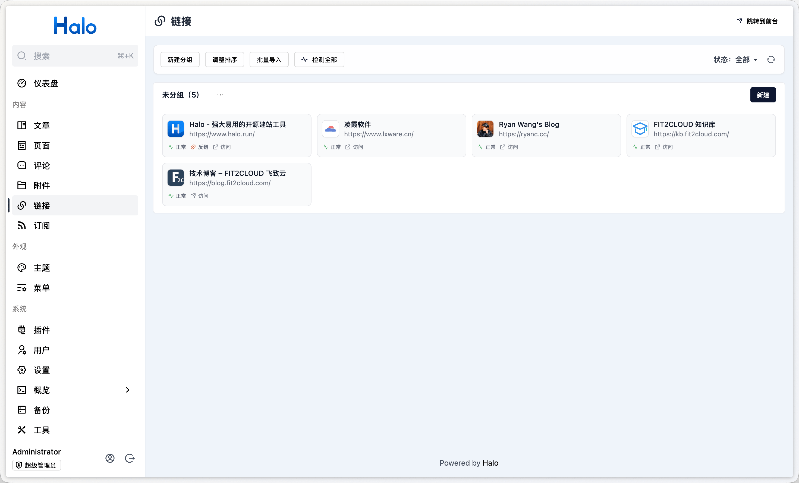
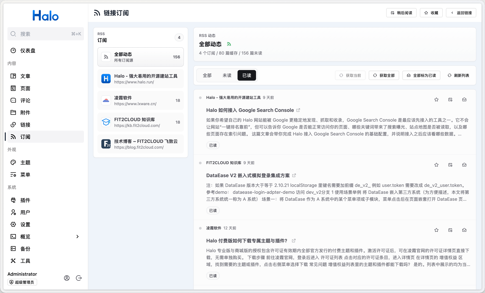

# 链接管理

plugin-links 是 Halo 2.0 的链接管理插件，用于管理友情链接、检查链接状态，并将链接站点的 RSS / Atom 动态聚合到 Halo Console 中。

插件同时提供 Console 管理界面、主题端 `/links` 页面路由、`linkFinder` Finder API 和匿名公共 REST API，适用于传统 Thymeleaf 主题和前端框架渲染的链接页。

## 功能特性

- 链接管理：支持名称、URL、Logo、描述、分组、排序和批量导入，可按需自动获取站点标题、描述和图标。
- 分组管理：支持创建、排序和删除分组，删除分组时可选择保留或同步删除组内链接。
- 状态检测：支持手动检测全部链接、按状态筛选链接，并记录访问状态、HTTP 状态码、最终跳转地址和错误信息。
- 反链检测：可为单个链接配置反链检测页面，检查对方页面是否包含指向当前 Halo 站点的链接。
- RSS 订阅：支持为链接配置一个或多个 RSS / Atom 地址，自动发现订阅地址，手动或定时获取订阅动态。
- 订阅阅读：在 Console 中查看全部或单个链接的订阅动态，支持未读筛选、全部标为已读、收藏和稍后阅读。
- 主题适配：提供 `/links` 页面、`linkFinder`、匿名公共 REST API。

## 安装使用

1. 下载插件 JAR：
   - GitHub Releases：访问 [Releases](https://github.com/halo-sigs/plugin-links/releases) 下载 Assets 中的 JAR 文件。
   - Halo 应用市场：<https://www.halo.run/store/apps/app-hfbQg>
2. 在 Halo Console 的插件管理中上传并安装插件，安装和更新方式可参考：<https://docs.halo.run/user-guide/plugins>
3. 安装完成后，访问 Console 左侧的**链接**菜单管理链接，访问**订阅**菜单查看 RSS 动态。
4. 如需自动检测链接或自动获取 RSS，请在插件设置中配置**链接检测**和**RSS 订阅**。
5. 前台访问地址为 `/links`。此路由需要主题提供 `links.html` 模板。

## 主题适配

此插件为主题端提供了：

- **列表路由** `/links`：模板为 `links.html`，支持通过 `group` 查询参数筛选分组。
- **Finder API** `linkFinder`：支持 `groupBy()`、`listBy(group)`、`random(maxSize)` 和 `count()`。
- **公共 REST API**：匿名只读接口，可用于 React / Vue / Svelte 等前端框架构建客户端渲染链接页。
- **评论来源适配**：可在链接页面接入 Halo 评论组件。
- **状态字段**：`LinkVo.status` 暴露 RSS 获取状态、链接访问检测状态和反链检测状态，主题可按需展示。

详细文档请参考：

- [主题 API 文档](./dev/theme-api.md) — 模板路由、模板变量、Finder API、评论适配、类型定义和元数据适配。
- [REST API 文档](./dev/rest-api.md) — 公共 API、Console API 和标准 CRUD 端点。

## 开发文档

本地开发、构建、测试和 API 客户端生成说明请参考 [开发文档](./dev/dev.md)。
